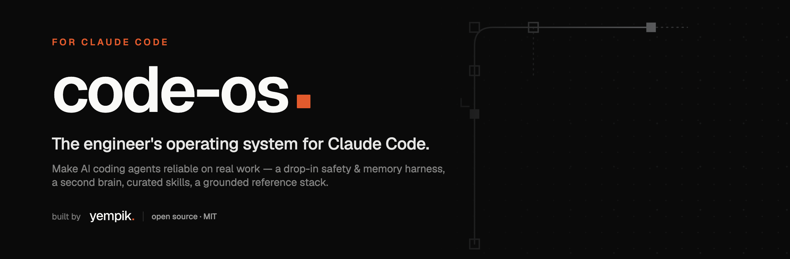

<div align="center">



# `code-os`

### The engineer's operating system for Claude Code.

Make AI coding agents reliable on real work — not clever autocomplete. A set of **drop-in harnesses, grounded references, and field-tested tooling** for running long-running agents on production codebases: an agentic safety + memory harness, an Obsidian second brain, curated skills, a vendor-neutral reference stack, and the people worth following.

<br>


<sub><b>In produzione, non in slide.</b> · by <a href="https://yempik.com"><b>yempik.</b></a> · maintained by <a href="https://www.linkedin.com/in/simone-bova/"><b>Simone Bova</b></a></sub>

</div>

---

## Two founders, two systems, one hat

`code-os` is the **builder's half** of a pair.

| | [`cowork-os`](https://github.com/yempik-ai/cowork-os) — [Raffaele Zarrelli](https://www.linkedin.com/in/raffaele-zarrelli/) | **`code-os`** — [Simone Bova](https://www.linkedin.com/in/simone-bova/) |
|:--|:--|:--|
| **Surface** | Claude **Cowork** | Claude **Code** |
| **For** | business & ops teams who don't write code | engineers running agents on real codebases |
| **Core idea** | the AI as a *company memory*, not a throwaway chat | the AI as a *reliable long-running collaborator*, not autocomplete |
| **You leave with** | a workspace that remembers your decisions | a harness that keeps agents honest across multi-day work |

Same problem — *use AI as a system, not a session* — solved from two different heads. Same hat: **yempik.**

---

## Why this exists

Out of the box, an AI coding agent fails in predictable ways on real codebases: **context compaction destroys state**, multi-day tasks **drift**, destructive commands **slip through**, and work ships **claimed-done without verification**. `code-os` fixes those with *file-based discipline* — survival-kit memory, spec→plan→execute loops, enforcement hooks, and grounded references — rather than prompt tricks.

Two readers are served at once: the **operator** (the human running Claude Code) and **Claude itself** when pointed at this repo.

---

## What's inside — five self-contained modules

> Each module under [`modules/`](modules/) stands alone. Use one without the others.

| Module | Folder | TL;DR |
|:--|:--|:--|
| ⚙️ **Agentic harness** | [`modules/agentic-harness/`](modules/agentic-harness/index.md) | Stack-agnostic drop-in for any git repo: survival-kit files, spec→plan→execute loop, ~5 enforcement hooks, a tailored `CLAUDE.md`. The hero. |
| 🧠 **Second brain** | [`modules/second-brain/`](modules/second-brain/index.md) | Obsidian knowledge vault driven by Claude Code. Three-layer architecture, slash commands, hooks, cross-device sync. |
| 🔌 **Skills & plugins** | [`modules/skills-guide/`](modules/skills-guide/useful-skills.md) | Opinionated guide to the plugins / MCPs / workflows worth installing — *what / why / when / for whom / how*, plus a security-audit procedure. |
| 📚 **Tech references** | [`modules/tech-references/`](modules/tech-references/index.md) | Reference stack + an adversarially-verified tool-orchestration compendium (SOTA, June 2026) + vendor-neutral production patterns — and a brief-driven workflow to turn them into a plan. |
| 🛠️ **AI tools & people** | [`modules/ai-tools/`](modules/ai-tools/useful-ai-tools.md) · [`modules/personas/`](modules/personas/people-to-follow.md) | The AI-native tools worth a look, and the practitioners shaping agentic engineering. |

---

## Install

**As a Claude Code plugin** — the runnable core (an always-on skill + five commands):

```bash
/plugin marketplace add yempik-ai/code-os
/plugin install code-os@code-os
```

**As the full kit** — clone the repo, then either paste [`INSTALL.md`](INSTALL.md) into Claude Code (it asks your goal and routes you to the right module) or follow [`GETTING_STARTED.md`](GETTING_STARTED.md) module by module. What each module can set up for you is catalogued in [`capabilities.md`](capabilities.md).

---

## Pick your path

```text
"I want Claude Code to behave reliably on my codebase."   ← start here
   → modules/agentic-harness/index.md → DAY-0-CHECKLIST.md → BOOTSTRAP.md
   ⏱  ~10min human prep + ~1–2h supervised setup

"I want a personal knowledge vault."
   → modules/second-brain/index.md → DAY-0-CHECKLIST.md → BOOTSTRAP.md
   ⏱  ~1h human prep + ~2h supervised setup

"Which plugins are actually worth installing?"
   → modules/skills-guide/useful-skills.md        (reference; install à la carte)

"What should I build this with / how should agents orchestrate tools?"
   → modules/tech-references/index.md              (reference stack + brief workflow)
```

---

## Repo layout

```text
code-os/
├── README.md                 ← you are here
├── index.md                  ← full repo map (start here to navigate)
├── INSTALL.md                ← paste into Claude Code: it asks your goal and routes you
├── GETTING_STARTED.md        ← the two setup paths (guided / per-module)
├── capabilities.md           ← what each module can set up for you
├── CONTRIBUTING.md           ← how to contribute
├── LICENSE                   ← MIT
├── .claude-plugin/           ← marketplace manifest (installable in Claude Code)
├── plugins/code-os/          ← the plugin: always-on core skill + 5 slash commands
├── docs/                     ← README / social assets (banner, social preview)
└── modules/
    ├── agentic-harness/      ← drop-in agent-memory + safety harness for any repo
    ├── second-brain/         ← Obsidian knowledge vault on Claude Code
    ├── tech-references/      ← reference stack + orchestration research + patterns
    ├── skills-guide/         ← curated plugins / MCPs / workflows
    ├── ai-tools/             ← AI-native tools worth a look
    └── personas/             ← people worth following
```

---

## Notes for agents reading this repo

- **Each module is self-contained.** Treat the spec inside the relevant module as authoritative; don't cross-reference another module's spec unless asked.
- **`BOOTSTRAP.md` files are self-contained prompts** inside `===== BEGIN PROMPT =====` fences — read the referenced files top-to-bottom before acting, then run the setup checklist.
- **Deferred tools are deferred for a reason.** Push back on anyone proposing them on Day 1.
- **References are grounded** — every claim is tied to a version source or fetched URL. Preserve that discipline when extending them.

---

<div align="center">
<sub>Built by <a href="https://yempik.com"><b>yempik.</b></a> · <i>L'AI che gli altri ti lasciano in slide, noi te la mettiamo in produzione.</i> · For the full map, see <a href="index.md"><code>index.md</code></a></sub>
</div>
